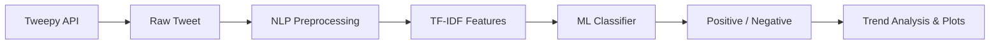

# Twitter Sentiment Analysis

End-to-end **NLP + Machine Learning** system to classify public opinion from Twitter data. Includes text preprocessing, TF-IDF feature engineering, scikit-learn classifiers, live tweet fetching via **Tweepy**, and sentiment **trend visualization**.

## Tech Stack

| Layer | Tools |
|-------|--------|
| Language | Python 3.10+ |
| NLP | NLTK (tokenization, stopwords, lemmatization) |
| ML | scikit-learn (Logistic Regression, Naive Bayes, Linear SVM) |
| Data | pandas, NumPy |
| Twitter API | Tweepy v2 |
| Viz | matplotlib, seaborn, wordcloud |

## Project Structure

```
twitter_sentiment_analysis/
├── config.yaml              # Hyperparameters and paths
├── data/
│   ├── sample/              # Demo training set (~240 tweets)
│   ├── raw/                 # Place full Sentiment140 CSV here
│   └── processed/           # Sampled subsets
├── models/                  # Trained classifier + vectorizer (.joblib)
├── outputs/                 # Plots and analysis reports
├── scripts/
│   ├── train_model.py       # Train / compare models
│   ├── predict_tweet.py     # Single-tweet inference
│   ├── fetch_and_analyze.py # Live search + trend charts
│   ├── stream_sentiment.py  # Filtered stream (Elevated API)
│   └── prepare_sentiment140.py
└── src/
    ├── preprocessing/       # Text cleaning pipeline
    ├── features/            # TF-IDF vectorizer
    ├── models/              # Training & evaluation
    ├── inference/           # Real-time prediction
    ├── twitter/             # Tweepy client
    └── analysis/            # Trend & word clouds
```

## Quick Start

### 1. Setup

```bash
cd twitter_sentiment_analysis
python3 -m venv .venv
source .venv/bin/activate   # Windows: .venv\Scripts\activate
pip install -r requirements.txt
cp .env.example .env        # Add Twitter API credentials for live fetch
```

### 2. Train on sample data

```bash
python scripts/train_model.py
```

Compare all three classifiers:

```bash
python scripts/train_model.py --compare
```

### 3. Predict sentiment

```bash
python scripts/predict_tweet.py "I love this project, amazing work!"
python scripts/predict_tweet.py "This is terrible and broken"
```

### 4. Live Twitter analysis (requires API keys)

```bash
python scripts/fetch_and_analyze.py "#ArtificialIntelligence lang:en" --max-results 50
```

Outputs land in `outputs/latest_run/`:
- `analyzed_tweets.csv`
- `sentiment_distribution.png`
- `sentiment_timeline.png`
- `wordcloud_positive.png` / `wordcloud_negative.png`
- `summary.json`

### 5. Real-time stream (Elevated access)

```bash
python scripts/stream_sentiment.py --rule "#Python lang:en"
```

## Training on Sentiment140 (full dataset)

1. Download `training.6M.csv` from [Sentiment140 on Kaggle](https://www.kaggle.com/datasets/kazanova/sentiment140).
2. Place it in `data/raw/training.6M.csv`.
3. Create a manageable subset:

```bash
python scripts/prepare_sentiment140.py --input data/raw/training.6M.csv --samples 50000
```

4. Train on the subset:

```bash
python scripts/train_model.py --data data/processed/sentiment140_sample.csv --compare
```

## Pipeline Overview



### NLP preprocessing

- Lowercasing and contraction expansion
- URL and @mention removal
- Hashtag tokenization
- Stopword removal
- WordNet lemmatization

### Models

| Model | Key trait |
|-------|-----------|
| Logistic Regression | Strong baseline, probability scores |
| Multinomial Naive Bayes | Fast, works well with sparse text |
| Linear SVM | High accuracy on text classification |

Metrics reported: **accuracy**, **F1**, **5-fold CV F1**, confusion matrix.

## Twitter API setup

1. Create a project at [developer.twitter.com](https://developer.twitter.com/).
2. Generate a **Bearer Token** (minimum for search).
3. Add to `.env`:

```
TWITTER_BEARER_TOKEN=your_token_here
```

## Resume / viva talking points

- **Problem**: Classify tweet polarity for brand monitoring, election analysis, or product feedback.
- **Approach**: Classical ML + TF-IDF (interpretable, fast, no GPU) — standard for academic NLP projects.
- **Trade-off**: Deep learning (BERT) can improve accuracy but needs more compute; this stack is reproducible on a laptop.
- **Extensions**: Add neutral class, VADER baseline, fine-tune `distilbert-base-uncased`, deploy via FastAPI.

## License

MIT — use freely for coursework and portfolio projects.
